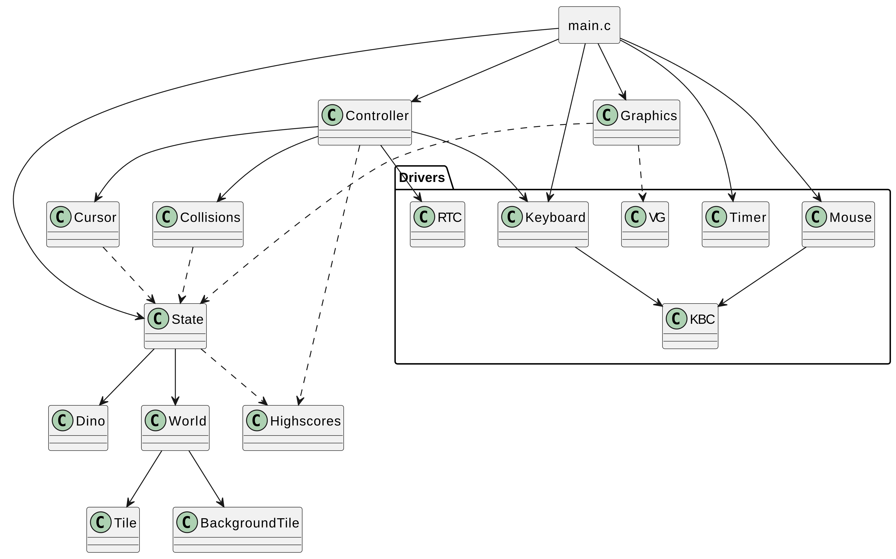

# debugassaurus

_debugassaurus_ is an endless runner inspired by the Google Chrome Dino game. The player must survive as long as possible while avoiding cacti and pterodactyls.

Our version adds play/pause functionality and a high score board that records the seed used for each score. Players can replay specific runs by using a hidden feature: in the main menu, pressing a number key reveals a seed input field.

## Screenshots

<style>
.image-grid {
  display: grid;
  grid-template-columns: repeat(3, 1fr);
  gap: 10px;
  margin: auto;
}
.image-grid img {
  width: 100%;
  height: auto;
  display: block;
  border-radius: 4px;
}
.page-break {
  page-break-before: always; /* or page-break-after: always; */
}
</style>

<div class="image-grid"></div>

## Video link

To watch our demo video [click here](https://uporto.cloud.panopto.eu/Panopto/Pages/Viewer.aspx?id=1e4335f1-e450-409f-bbb0-b2ee01204623)

## Running

```
cd src
make clean && make && lcom_run proj
```

## Controls

- `space` to jump. If `space` remains pressed the dino will keep jumping
- `esc` to pause

<div class="page-break"></div>

## Project Structure



The project follows an MVC pattern, and is therefore divided in three main modules: state, graphics and controller. As such, most of the logic in the main loop is reduced to these simples lines:

```c
state_menu();
update_handler* handlers = get_update_handlers();
while (state_get_screen() != EXIT) {
    // Handle interrupts
    // ...

    // Once every frame
    handlers[state_get_screen()]();
    graphics_frame();
}
```

### State

_debugassaurus_ has multiple screens, each represented by a screen_t enum value. Since each screen needs different state data - e.g., the main menu tracks buttons, the game screen tracks the world and dino - we use a union to save space. This requires care to avoid accessing invalid fields. Shared variables like the current screen and cursor position are stored outside the union.

```c
struct state {
    // Common types
    screen_t screen;
    cursor_position_t cursor;

    union {
        struct {
            dino_t* dino;
            tile_t* first_tile;
            background_tile_t* first_background;
            uint32_t seed;
            bool paused;
        } game;

        // ...
    } data;
};
```

Externally, the state exposes getters and setters for its variables, along with functions to switch screens, such as `state_main_menu()` and `state_highscores()`.

#### World generation

_debugassaurus_ presents an interesting challenge in terms of world representation, since it is an endless runner. The obstacles are represented as a linked list of `tile`s. While the `tile` class tile would be enough, the `world` class abstracts the world creation logic. This way, parts of the program that do not know about the state's internals can call `world_get_next(tile_t* tile)` to get the next tile in the world, and it will in fact always return a tile, as if all the tiles were pre-generated.

### Graphics

...

### Controller

The game is represented by a number of states (see above). The controller defines an array of update handlers, whose index corresponds to the screen_t enum value. These handlers are called once every frame.

#### Collisions

...

#### Highscores

When the player loses he can insert a name to associate with that run. If the score of the run was in the top 5 scores, it will add it to the correct position in the leaderboard, showing its name, score, date and seed of the run.

## Devices

**Timer:** Used for periodic rendering and keeping track of the time. Using the interrupt frequency, we were able to control the dino's speed and score.

```c
// main.c

uint32_t timer_frequency = sys_hz();
uint32_t ticks_per_frame = timer_frequency / FPS;

// Setting up interrupt handlers

if (msg.m_notify.interrupts & timer_mask) {
    if (timer_get_ticks(); == ticks_per_frame) {
        timer_set_ticks(0);
        // Frame logic
    }
}
```

**Keyboard:** Used for navigation in menus and player input during the game. A simple API was added that could be used either to check if a key was pressed or to consume a key if pressed (if the consume function is called twice, the second call will return false). Character keys are returned in a pointer passed as argument:

```c
// Jump if space is pressed
if (keyboard_is_pressed(SPACE, NULL)) dino_jump(dino);

// Pause game if esc is pressed. Esc will likely remain pressed for many frames
// and we only want to detect it once. As such, we consume it.
if (keyboard_consume(ESC, NULL)) state_pause();

// Get a character input
char c;
if (keyboard_consume(CHARACTER, &c)) {
    // Do something with character
}
```

**Mouse:** Used for navigation in menus. Here's an excerpt from cursor.c:

```c
void cursor_update() {
    if (!mouse_ready()) return;

    cursor_position_t position = state_get_cursor_position();

    position.x = cursor_update_within_range(position.x, mouse_delta_x(), vg_get_width() - 1);
    position.y = cursor_update_within_range(position.y, -mouse_delta_y(), vg_get_height() - 1);
    state_set_cursor_position(position);

    if (state_get_screen() == MENU && mouse_lb()) {
        for (/* every button */) {
            // Check if the cursor is within the button's area

            screen_t screen = button_get_screen(button);
            if (screen == MENU) state_menu();
            // ...
        }
    }
}
```

**Video Card:** Used to display the game. We used the idexed mode 0x105, with the reasoning that only writing one byte per pixel improves the performance of the game. Our implementation uses page flipping to avoid visual artifacts.

```c
// Clear the second buffer
vg_clear();

// Other vg calls that draw the game
// ...

// Flip the buffers in between retraces
vg_flip();
```

**Real Time Clock** Used to get the date to be kept in a highscore. The simple API that is exposed is this:

```c
typedef struct {
    uint8_t day;
    uint8_t month;
    uint8_t year;
} date_t;

int rtc_get_date(date_t *date);
```
