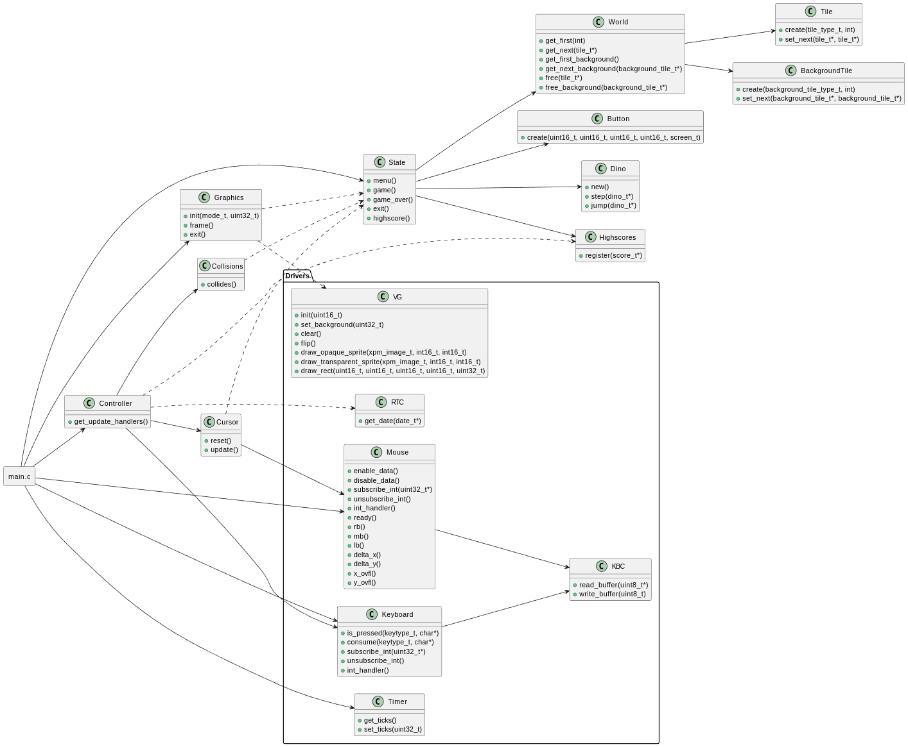

# debugassaurus

_debugassaurus_ is an endless runner inspired by the Google Chrome Dino game. The player must survive as long as possible while avoiding cacti and pterodactyls.

Our version adds play/pause functionality and a high score board that records the seed used for each score. Players can replay specific runs by using a hidden feature: in the main menu, pressing a number key reveals a seed input field.

Screenshot

Video link

## Controls

- `space` to jump. If `space` remains pressed the dino will keep jumping
- `esc` to pause

## Project Structure



The project follows an MVC pattern, and is therefore divided in three main modules: state, graphics and controller. As such, the logic in the main loop is reduced to these simples lines:

```c
int(proj_main_loop)(int argc, char* argv []) {
    // Initialize drivers
    // ...

    state_menu();
    cursor_reset();

    update_handler* handlers = get_update_handlers();
    while (state_get_screen() != EXIT) {
        // Handle interrupts
        // ...

        // Once every frame
        handlers[state_get_screen()]();
        graphics_frame();
    }

    // Unmount drivers
}
```

### State

_debugassaurus_ has various screens. Each of those is represented as a variable in the `screen_t` enum. Each of those screens, though, needs a different representation of the state. The main menu, for instance, needs to know which buttons exist, while the game screen need to know what the world looks like and where the dino is. We could use a number of unused fields in a structure, but that would be a waste of space. Instead, we opt to use a union to represent the different states of the game. The problem this creates is that one must be careful to not access wrong fields in the union. Common variables (current screen and cursor position, which should be kept accross screens) are stored outside the union.

```c
struct state {
    // Common types
    screen_t screen;
    cursor_position_t cursor;

    union {
        struct {
            uint8_t button_count;
            button_t** buttons;
            char seed_input[16];
        } menu;

        struct {
            dino_t* dino;
            tile_t* first_tile;
            background_tile_t* first_background;
            uint32_t seed;
            bool paused;
        } game;
        
        // ...
    } data;
};
```

Externally, the state exposes a set of getters and setters that give access to the state variables. There are also some functions that allow to switch between different states, like `state_main_menu()` and `state_highscores()`.

#### World generation

_debugassaurus_ presents an interesting challenge in terms of world representation, since it is an endless runner. The obstacles are represented as a linked list of `tile`s. While the `tile` class tile would be enough, the `world` class abstracts the world creation logic. This way, parts of the program that do not know about the state internals can call `world_get_next(tile_t* tile)` to get the next tile in the world, and it will in fact always return a tile, as if all the tiles were pre-generated.

### Graphics

...

### Controller

The game is represented by a number of states (see above). For each of those states, the controller defines an update handler whose index is the same as the screen_t enum value. The update handler should be called once every frame.

```c
typedef void (*update_handler)();
update_handler* get_update_handlers();
```

An example usage is given above in the project's main loop.

#### Graphics

...

#### Highscores

...

## Devices

**Timer:** Used for periodic rendering and keeping track of the time. Using the interrupt frequency, we were able to control the dino's speed and score.

```c
// main.c

uint32_t timer_frequency = sys_hz();
uint32_t ticks_per_frame = timer_frequency / FPS;

// Setting up interrupt handlers
// ...

if (msg.m_notify.interrupts & timer_mask) {
    uint32_t ticks = timer_get_ticks();
    if (ticks == ticks_per_frame) {
        timer_set_ticks(0);
        // Frame logic
    }
}

// dino.c

static const double delta_time = 1 / (double) FPS;
static const double delta_speed = DINO_SPEED_INCREMENT * delta_time;
static const double delta_score = POINTS_PER_SECOND * delta_time;

// ...

void dino_step(dino_t* dino) {
    dino->speed.x += delta_speed;
    dino->position.x += dino->speed.x * delta_time;
    dino->score += delta_score;
    
    // ...
}
```

**Keyboard:** Used for navigation in menus and player input during the game. A simple API was added that could be used either to check if a key was pressed or to consume a key if pressed (if the consume function is called twice, the second call will return false). Character keys are returned in a pointer passed as argument:

```c
// Jump if space is pressed
if (keyboard_is_pressed(SPACE, NULL)) dino_jump(dino);

// Pause game if esc is pressed. Esc will likely remain pressed for many frames
// and we only want to detect it once. As such, we consume it.
if (keyboard_consume(ESC, NULL)) state_pause();

// Get a character input
char c;
if (keyboard_consume(CHARACTER, &c)) {
    // Do something with character
}
```

**Mouse:** Used for navigation in menus. Here's an excerpt from cursor.c:

```c
void cursor_update() {
    if (!mouse_ready()) return;

    cursor_position_t position = state_get_cursor_position();
    
    position.x = cursor_update_within_range(position.x, mouse_delta_x(), vg_get_width() - 1);
    // For y displacement, the graphics driver disagrees with the mouse driver.
    // We opt to use the graphics driver's coordinate system, whose origin is at
    // the top-left corner.
    position.y = cursor_update_within_range(position.y, -mouse_delta_y(), vg_get_height() - 1);
    state_set_cursor_position(position);

    if (state_get_screen() == MENU && mouse_lb()) {
        for (/* every button */) {
            if (button_get_x(button) >  position.x || button_get_y(button) > position.y) continue;
            if (button_get_x(button) + button_get_width(button) <  position.x ||
                button_get_y(button) + button_get_height(button) < position.y) continue;
            
            screen_t screen = button_get_screen(button);
            if (screen == MENU) state_menu();
            // ...
        }
    }
}
```

**Video Card:** Used to display the game. We used the idexed mode 0x105, with the reasoning that only writing one byte per pixel improves the performance of the game. Our implementation uses page flipping to avoid visual artifacts.

```c
// Clear the second buffer
vg_clear();

// Other vg calls that draw the game
// ...

// Flip the buffers in between retraces
vg_flip();
```

**Real Time Clock** Used to get the date to be kept in a highscore. The simple API that is exposed is this:

```c
typedef struct {
    uint8_t day;
    uint8_t month;
    uint8_t year;
} date_t;

int rtc_get_date(date_t *date);
```
